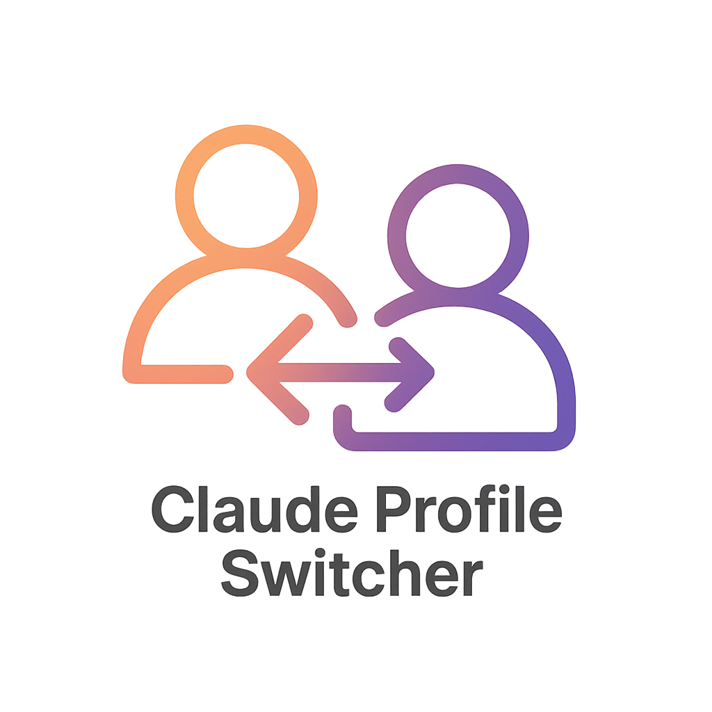

<p align="center">
  
</p>

# claude-profile-switcher

CLI tool to switch Claude Code authentication profiles. Manage multiple Claude Code authentication methods (Max plan OAuth vs API keys) and switch between them.

## Installation

### Homebrew (macOS/Linux)

```bash
brew tap manashmandal/tap
brew install claude-profile
```

### From source

```bash
git clone https://github.com/manashmandal/claude-code-profile-switcher.git
cd claude-code-profile-switcher
bun install
bun link
```

## Usage

### Add profiles

```bash
# Interactive
claude-profile add

# Non-interactive
claude-profile add work --api-key sk-ant-...
claude-profile add personal --max
```

### Switch profiles

```bash
# Switch and apply to current shell (bash/zsh)
eval $(claude-profile work)

# Fish shell
eval (claude-profile work)

# Interactive selection
eval $(claude-profile)  # or eval (claude-profile) in fish

# Dry run (see what would happen)
claude-profile work --dry-run
```

The tool auto-detects your shell (fish vs bash/zsh) and outputs the correct syntax.

### Other commands

```bash
claude-profile list      # List all profiles
claude-profile current   # Show active profile
claude-profile remove <name>  # Remove a profile
```

## How it works

This tool manages authentication by setting the `ANTHROPIC_API_KEY` environment variable:

- **API key profiles**: Sets `export ANTHROPIC_API_KEY='sk-ant-...'`
- **Max plan profiles**: Unsets the variable with `unset ANTHROPIC_API_KEY` (uses OAuth)

Profile configurations are stored in `~/.claude-profiles.json`. The tool **never** modifies `~/.claude/settings.json`.

## Shell integration (optional)

**Bash/Zsh** - Add to `~/.zshrc` or `~/.bashrc`:

```bash
cps() {
  eval $(claude-profile "$@")
}
```

**Fish** - Add to `~/.config/fish/config.fish`:

```fish
function cps
  eval (claude-profile $argv)
end
```

Then use: `cps work` or `cps personal`

## License

MIT
